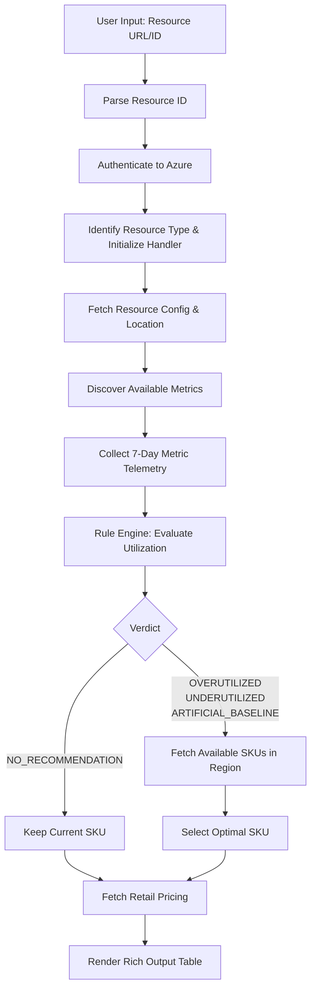

# Azure SKU Recommendation Engine: Project Flow & Logic

This document details the end-to-end execution flow of the Azure SKU Recommendation tool and provides a deep dive into the logic used to recommend optimal SKUs.

## High-Level Execution Flow

## Step-by-Step Breakdown

### 1. Resource Input and Parsing (`parse_resource_id`)
The script accepts either a full Azure Portal URL or a raw ARM Resource ID. It parses this string to extract critical components:
- `subscription_id`
- `resource_group`
- `provider` (e.g., `microsoft.compute`)
- `resource_type` (e.g., `virtualmachines`)
- `resource_name`

### 2. Authentication (`_get_credential`)
The tool attempts a chained authentication approach:
1. **Azure CLI**: First tries to use existing cached tokens from `az login`.
2. **Interactive Browser**: If CLI credentials are not found or expired, it falls back to prompting an interactive browser login.

### 3. Resource-Specific Handlers (`HANDLER_REGISTRY`)
Azure resources behave differently depending on their type. The tool uses a registry mapping to assign a specific handler based on the resource type (e.g., `VMHandler`, `AKSHandler`, `AppServicePlanHandler`, `SQLDatabaseHandler`). 
The handler is responsible for:
- Fetching the current configuration (`get_config`): Details like the current SKU, vCPU cores, Memory, and default capacity (e.g., 100% for CPU usage).
- Defining primary metrics to monitor (`get_metric_definitions`): e.g., `Percentage CPU` and `Available Memory Bytes` for VMs.
- Listing available SKUs for that specific resource in its deployed region (`list_skus`).

### 4. Metrics Collection
- **Discovery**: Queries Azure Monitor (`discover_metrics`) to find all metrics that support an `Average` aggregation type.
- **Collection**: Fetches the last **7 days** of telemetry data at a 1-hour interval (`collect_metrics`). Metrics are fetched in batches of 20 (Azure Monitor API limit). It retrieves the `Average`, `Maximum`, and `Minimum` values across the timeseries.

### 5. The Rule Engine (Evaluation Logic)
The `evaluate` function analyzes the collected metrics against the configured capacities to assign a "verdict" for the resource.

It first calculates a **Baseline**:
`Baseline = min(1.3 * Average_Usage, Capacity)`

Then, it evaluates rules across the metrics in priority order (highest priority wins):
1. **`ARTIFICIAL_BASELINE`:**
   - **Condition:** Actual usage is between 20% and 80% of configured capacity (properly provisioned), but fails the baseline checks.
   - **Meaning:** The system is throwing a false positive alert due to a poor baseline calculation, even though the resource's actual usage is healthy.
2. **`OVERUTILIZED`:**
   - **Condition:** `Average_Usage > 0.8 * Capacity`
   - **Meaning:** The average usage consistently stays above 80% of the resource's absolute capacity. The resource is starving for capacity.
3. **`UNDERUTILIZED`:**
   - **Condition:** `Average_Usage < 0.2 * Capacity`
   - **Meaning:** The average usage stays below 20% of the resource's absolute capacity. The resource can be safely scaled down.
4. **`NO_RECOMMENDATION`:**
   - **Condition:** None of the above apply.
   - **Meaning:** The resource is appropriately sized.

### 6. SKU Recommendation Logic (`pick_sku`)
If a change is required, the script queries Azure for all valid SKUs in the resource's region (filtering out restricted ones) and applies the following mathematical logic:

*Note: The script inherently filters out any SKUs with less than 2 vCPUs.*

- **If `UNDERUTILIZED` (Downscale):**
  - **Goal:** Safely downscale without causing future bottlenecks.
  - **Requirement:** The new SKU must be capable of handling `1.5 * Current_Peak_Usage`.
  - **Selection:** It picks the **largest** SKU that fits this requirement while still being **smaller** than the current SKU. This provides maximum headroom while still saving money.

- **If `OVERUTILIZED` (Upscale):**
  - **Goal:** Provide enough resources to comfortably handle the load.
  - **Requirement:** The new SKU must be capable of handling `1.5 * Current_Peak_Usage`.
  - **Selection:** It picks the **smallest** SKU that fits this requirement and is **larger** than the current SKU.

- **If `ARTIFICIAL_BASELINE`:**
  - **Goal:** Retain the current SKU.
  - **Requirement:** No change needed.
  - **Selection:** Since the resource is already properly provisioned against its absolute capacity, no SKU change is recommended to prevent disruption.

### 7. Cost Estimation & Output Render
- The `fetch_price` function queries the **Azure Retail Prices API** to get the on-demand, hourly consumption price for both the *current* SKU and the *recommended* SKU.
- Finally, `render_output` uses the `rich` library to draw a formatted table showing:
  - Current state (SKU, Cores, RAM).
  - Telemetry averages, peaks, and baselines.
  - All discovered metrics.
  - The final verdict.
  - The recommended new SKU.
  - Estimated hourly and monthly cost savings (or cost increases for upscaling).
